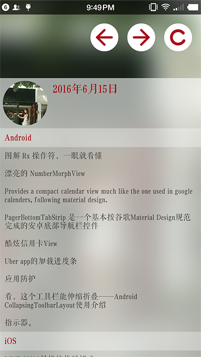
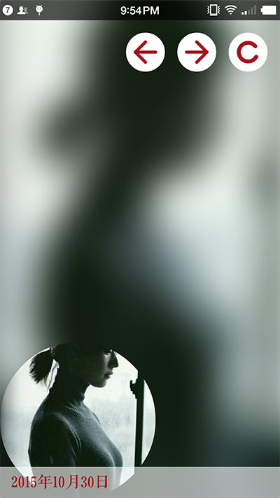
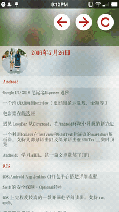

# Gank-Meizi
####利用[gank.io](http://gank.io/)开放的api制作的一个安卓app

###进度
* 目前主要做了主页的效果
* webview目前没有优化,后续会添加收藏和新的UI界面

###截图

###效果图

###我在开发中遇到的问题解决的参考
* [如何监听CollapsingToolbarLayout的展开与折叠](http://www.jcodecraeer.com/a/anzhuokaifa/androidkaifa/2016/0619/4362.html)
* [主要参考它CollapsingToolbarLayout中图片到顶部状态栏的设置,我搞了好久,最后在AppBarLayout和CollapsingToolbarLayout同时设置android:fitsSystemWindows="true"](https://github.com/chrisbanes/cheesesquare)
